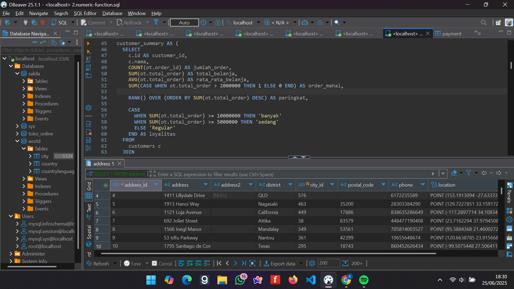
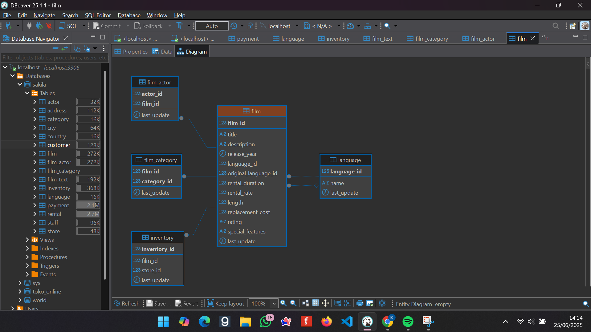

# 📊 Panduan Penggunaan DBeaver

Berikut ini adalah dokumentasi visual tentang penggunaan **DBeaver** untuk mengelola database secara visual.

---

## 🖥️ Tampilan UI DBeaver

Gambar berikut menampilkan **antarmuka utama DBeaver** saat pertama kali dijalankan. Di sini, pengguna bisa melihat panel navigator, query editor, dan hasil eksekusi SQL.

  

---

## 🛠️ Contoh Penggunaan DBeaver

Pada gambar berikut, terlihat contoh bagaimana kita dapat **menampilkan hasil relasi antar table yang berbentuk diagram**
agar lebih mudah untuk mengelolanya

  

